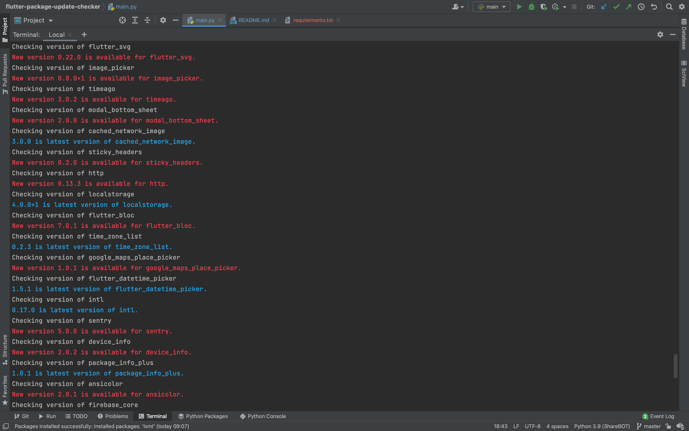

# Flutter Package Update Checker

Quickly check if new versions are available for packages listed in your Flutter project’s `pubspec.yaml`.

### Setup & Usage

1. Clone the repository.
2. Install dependencies : `pip install -r requirements.txt`
3. From the Flutter project directory, run: `python main.py` Or provide a full path to your flutter project `python main.py
   /full/path/to/flutter-project`
4. Done! The script will output available package updates.
